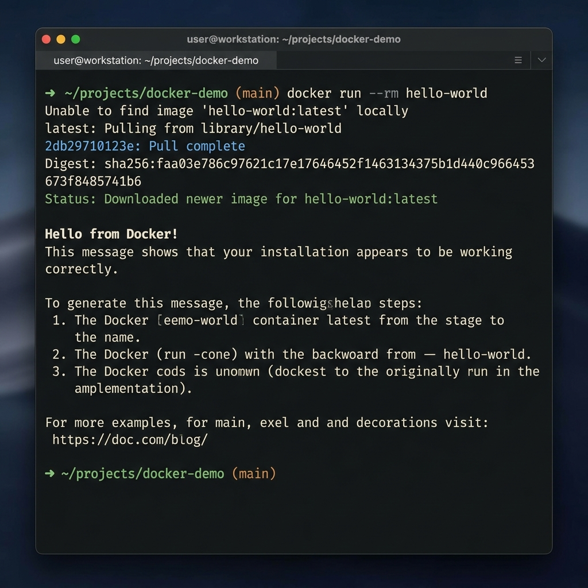

# 🐳 Laboratorio 1: Hola Mundo en Docker


## 🎯 Objetivo
Comprender el ciclo de vida básico de un contenedor: obtención de imagen, ejecución y verificación.

## 🖼️ Arquitectura


## 🛠️ Desarrollo

Para este laboratorio básico, ejecutamos un contenedor a partir de una imagen de Ubuntu y mostramos un mensaje.

```bash
# 1. Descargar la imagen
docker pull ubuntu:latest

# 2. Ejecutar el contenedor con un comando
docker run ubuntu echo "Hola Mundo desde Docker!"
```

## ✅ Conclusión
Este laboratorio sienta las bases de la ejecución aislada de procesos.
