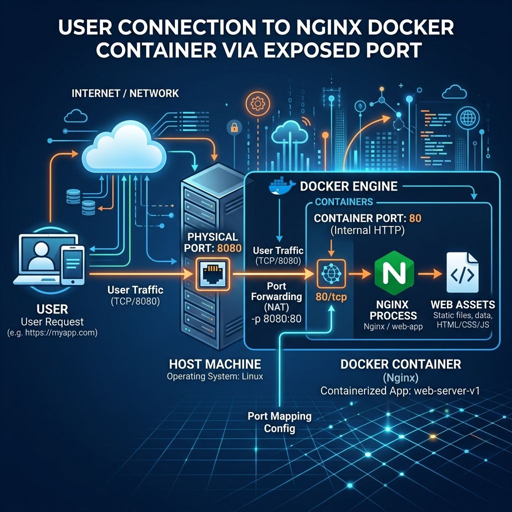

# 🌐 Laboratorio 2: Acceso Público de Contenedores


## 🎯 Objetivo
Aprender a exponer puertos de un contenedor hacia el host para permitir acceso público a servicios.

## 🖼️ Arquitectura


## 🛠️ Desarrollo

Se despliega un servidor web Nginx mapeando el puerto 80 del host al puerto 80 del contenedor.

```bash
# Ejecutar Nginx exponiendo puertos
docker run -d --name mi_servidor_web -p 80:80 nginx

# Verificar mapeo de puertos
docker port mi_servidor_web
```
Accediendo a `http://localhost:80` se puede visualizar la página de bienvenida de Nginx.

## ✅ Conclusión
La exposición de puertos (Port Binding) es fundamental para comunicar servicios en contenedores con el mundo exterior.
