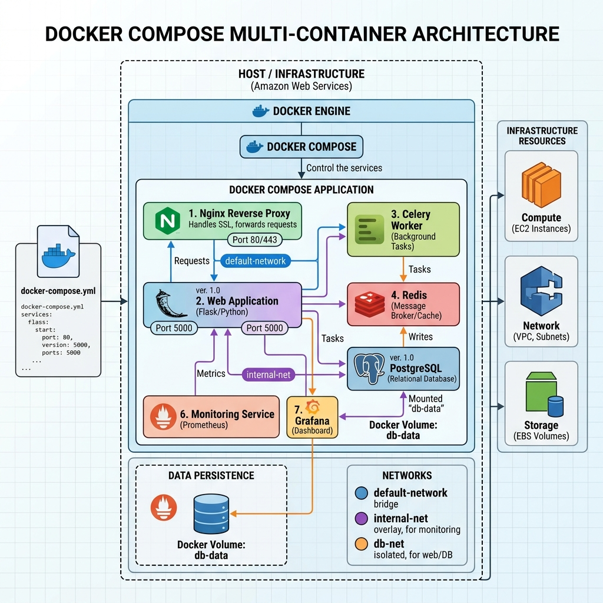

# Lab 3: Orquestacion con Docker Compose


## Objetivo

Orquestar multiples contenedores de forma declarativa usando un archivo `docker-compose.yml`.

## Arquitectura



## Archivos del laboratorio

| Archivo | Descripcion |
|---------|-------------|
| `docker-compose.yml` | Archivo de orquestacion que define los servicios web y db |
| `PRUEBAS.md` | Evidencia real de la ejecucion del laboratorio |

## Desarrollo

### 1. Archivo docker-compose.yml

Se creo un archivo de orquestacion que despliega dos servicios simultaneamente:

```yaml
version: '3.8'
services:
  web:
    image: nginx:alpine
    ports:
      - "8081:80"
  db:
    image: redis:alpine
```

- **web**: Servidor Nginx accesible en el puerto 8081 del host.
- **db**: Base de datos Redis en memoria para cache.

### 2. Levantamiento de la infraestructura

```bash
$ docker compose up -d

Network lab_03_docker_compose_default Creating
Network lab_03_docker_compose_default Created
Container lab_03_docker_compose-db-1 Created
Container lab_03_docker_compose-web-1 Created
Container lab_03_docker_compose-db-1 Started
Container lab_03_docker_compose-web-1 Started
```

### 3. Verificacion del estado real

```bash
$ docker compose ps

NAME                          IMAGE          COMMAND                  SERVICE   STATUS         PORTS
lab_03_docker_compose-db-1    redis:alpine   "docker-entrypoint..."   db        Up 5 seconds   6379/tcp
lab_03_docker_compose-web-1   nginx:alpine   "/docker-entrypoint..."  web       Up 5 seconds   0.0.0.0:8081->80/tcp
```

Ambos contenedores estan en estado **Up** y conectados a la red compartida `lab_03_docker_compose_default`.

### 4. Limpieza

```bash
docker compose down
```

## Evidencia

La evidencia completa de la ejecucion esta disponible en [PRUEBAS.md](./PRUEBAS.md).

## Conclusion

Docker Compose simplifica enormemente el despliegue de arquitecturas multicontenedor. Con un solo archivo YAML se define toda la infraestructura, lo que permite reproducibilidad y versionamiento de entornos completos.

---
**Autor:** Carlos Alberto Gonzalez Bravo  
*Especializacion en Ciberseguridad - UNIMINUTO*
