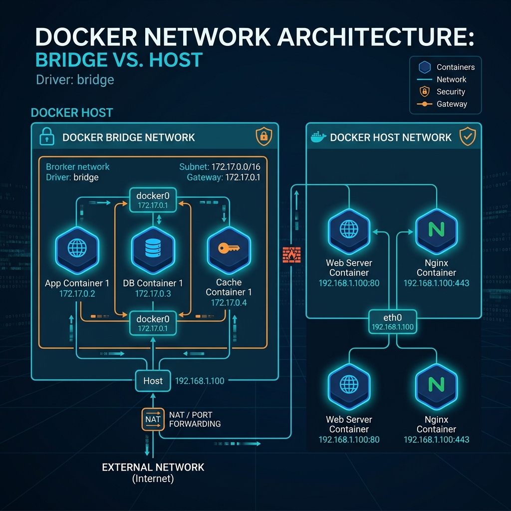

# 🕸️ Laboratorio 4: Redes en Docker


## 🎯 Objetivo
Explorar los distintos controladores de red de Docker (bridge, host, none) y establecer comunicación segura entre contenedores.

## 🖼️ Arquitectura


## 🛠️ Desarrollo

En este laboratorio, configuramos redes personalizadas para aislar lógicamente aplicaciones.

### 1. Creación de Redes
```bash
# Crear redes separadas
docker network create app_net
docker network create db_net
```

### 2. Conexión y Aislamiento
Levantamos contenedores asignándolos a redes específicas. Los contenedores en `app_net` no pueden ver a los de `db_net` por defecto, lo cual asegura el principio de mínimo privilegio en red.

```bash
# Levantar contenedor en la red de la aplicación
docker run -dit --name app_server --network app_net alpine sh

# Verificar comunicación
docker exec -it app_server ping [IP_OTRO_CONTENEDOR]
```

## ✅ Conclusión
El aislamiento de red en Docker previene movimientos laterales no autorizados y es una práctica crítica de **DevSecOps**.
